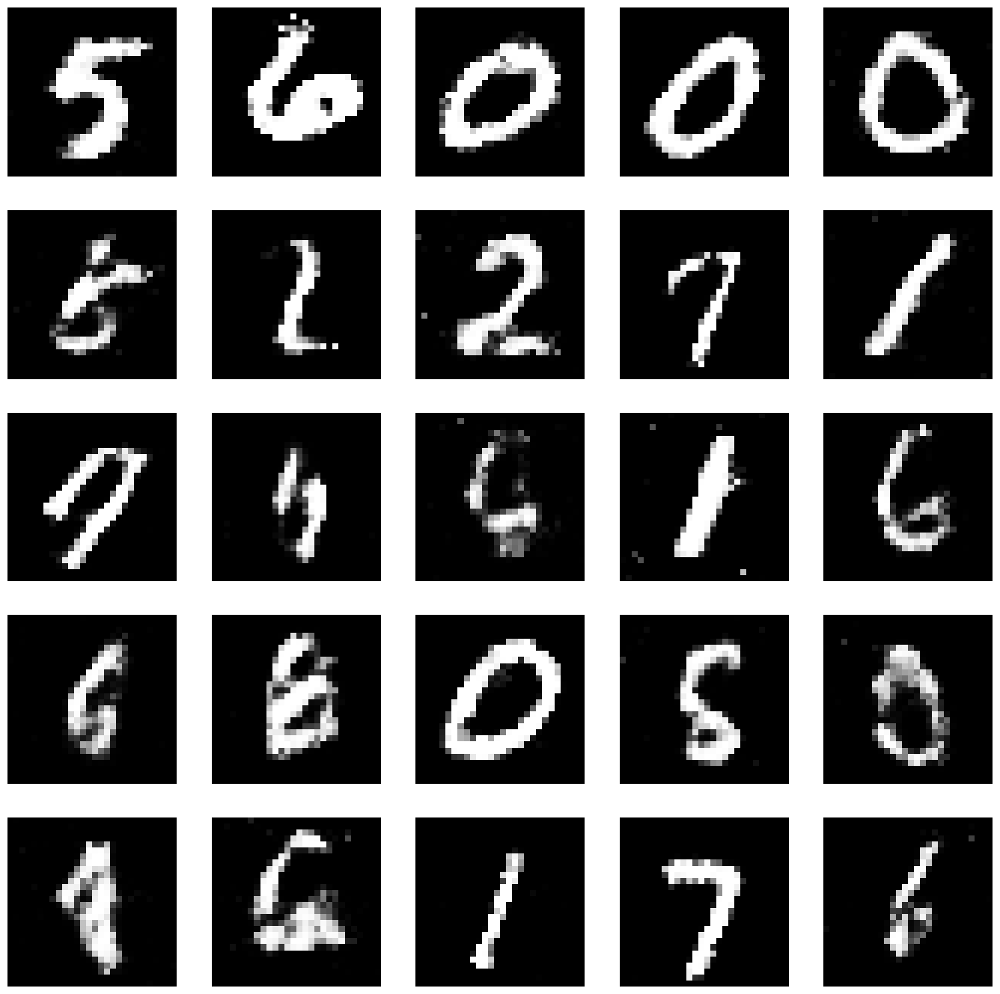

# Generative Adversarial Networks (GAN)

Implementation in code of the paper [Generative Adversarial Networks](https://arxiv.org/abs/1406.2661).

## Results 

<div align="center">
  
</div>

## Setup and Installation

### Prerequisites
Make sure you have Python 3.7+ installed on your system:
```bash
python --version
# or
python3 --version
```

### Option 1: Using Python venv

1. **Clone the repository:**
```bash
git clone https://github.com/bakirmohamed/GAN.git
cd GAN
```

2. **Create and activate virtual environment:**
```bash
# Create virtual environment
python -m venv gan_env

# Activate (Linux/macOS)
source gan_env/bin/activate

# Activate (Windows)
gan_env\Scripts\activate
```

3. **Install dependencies:**
```bash
pip install --upgrade pip
pip install -r requirements.txt
```

### Option 2: Using Conda

1. **Clone the repository:**
```bash
git clone <your-repo-url>
cd gan-implementation
```

2. **Create and activate conda environment:**
```bash
# Create environment
conda create -n gan_env python=3.9

# Activate environment
conda activate gan_env
```

3. **Install dependencies:**
```bash
pip install -r requirements.txt
```

## Usage

1. **Make sure your environment is activated:**
```bash
# For venv
source gan_env/bin/activate

# For conda
conda activate gan_env
```

2. **Run the training:**
```bash
python gans.py
```

3. **Generated images will be saved as `results.png`**

## Deactivate Environment

When you're done:
```bash
# For venv
deactivate

# For conda
conda deactivate
```

## Training Parameters

- **Epochs:** 20,000 (adjustable in code)
- **Batch size:** 100
- **Learning rate:** 0.02 (SGD optimizer)
- **Dataset:** MNIST (28x28 grayscale images)
